## 자기 소개
#### 안녕하세요. 최봉재입니다.
#### 제 소개 및 이력을 기재한 페이지입니다.

- 안드로이드 경력 1.x년 개발자
- 새로운것을 배우는걸 좋아합니다.
- 앱을 개발하여 퍼블리싱까지 해본경험이 있습니다. / PlayStore - 담고풀고
- 프로젝트에서 팀플을 매우 중요시 생각합니다. 디자이너, 기획자분들과 협업경험이 다 수 있습니다.
- 기획자에겐 무조건 안된다는 말보다는 차근차근 설명하려 합니다.
- https://zeplin.io/ 와 같은 협업툴을 사용해 본적이 있고 디자이너와도 대화를 많이 하려 노력합니다.
- Git 을 사랑합니다. - Repository 를 만드는일이 프로젝트 시작시 가장처음하는 일입니다.
- Commit 메세지를 중요시 여깁니다.
- REST API를 개발해본 경험이 있어 백엔드 개발자와 협업하기 보다 수월합니다.

___

##경력

[트램스](http://www.trams.co.kr/)
- 2015.07.22 ~ 2016.07.30

[애니웨어](http://u-anyware.com/)
- 2014.03.04 ~ 2014.07.14

___

##개인 프로젝트

###담고풀고

서운한 감정을 텍스트로 풀어 내보는 앱
- 기간 : 2016.08 ~ 현재
- 역할 : Android 앱 모든 개발부분 총괄
- 사용 기술 : Facebook API, Android, Spring
- [PlayStore 링크](https://play.google.com/store/apps/details?id=com.nexters.naemambo.naemambo)

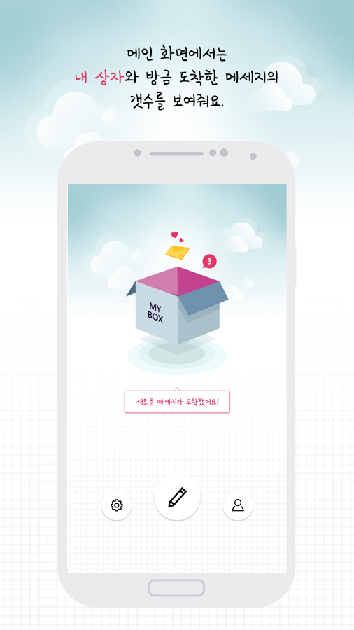
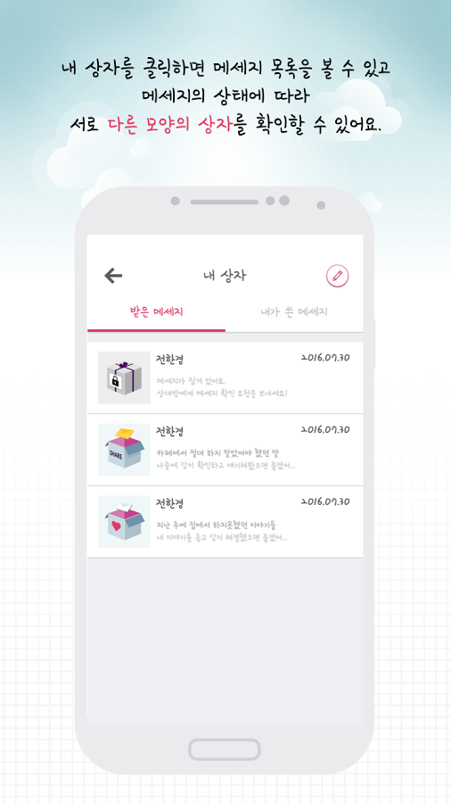
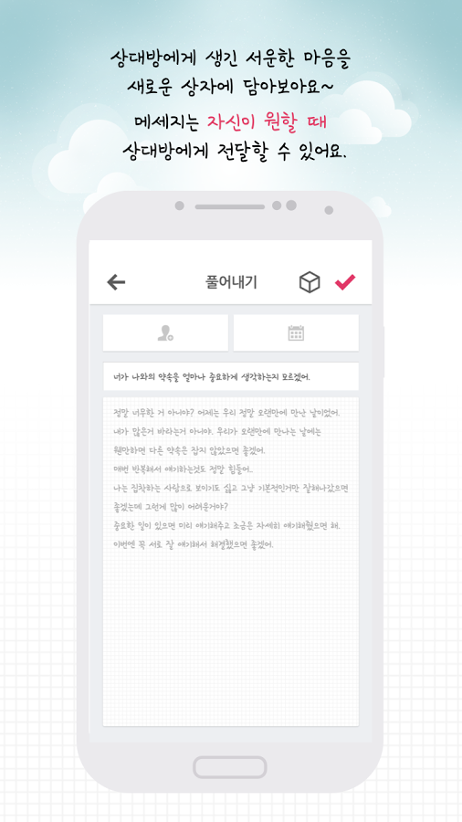
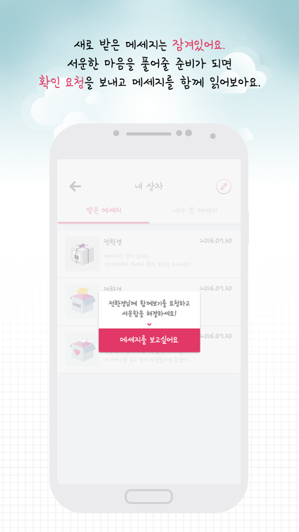
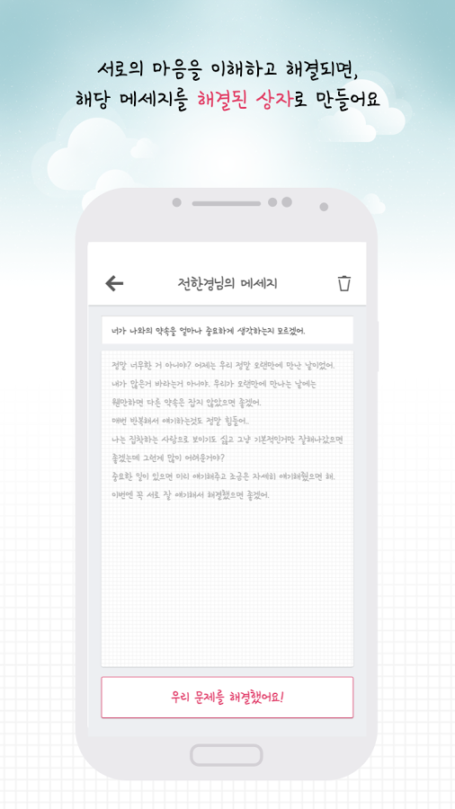

___

##참여 프로젝트

###1. SK T아카데미 IoT M2M 교재 개발
소켓통신을 활용한 원격카메라 제어, 원격 어플리케이션 실행 기능 개발
- 기간 : 2013.12 ~ 2014.02
- 역할 : 카메라 원격제어 기능 개발, 소켓통신 모듈 개발
- 사용기술 : Android, Java
- [홈페이지 링크](https://tacademy.sktechx.com/frontMain.action)

###2. EMSONEPACK 물류센터 PDA 앱
한국우편사업진흥원 EMSONEPACK(역직구 - 국내에서 해외로 합포장 서비스) 물류센터 직원용 PDA 앱
- 기간 : 2015.09 ~ 2016.02
- 역할 : UI 및 서버 통신 부분 개발
- 사용기술 : Android, Java
- [홈페이지 링크](https://www.emsonepack.com/)

###3. 법무부 편리한 공증제도 앱 개발
사용자 분류(공증인)에 따라 다른 화면을 보여주는 Custom UI 가 적용된 공증제도 홍보용 앱
- 기간 : 2015.08 ~ 2015.11
- 역할 : UI 및 서버 통신 부분 개발, REST API 개발
- 사용기술 : Android, Java
- [PlayStore 링크](https://play.google.com/store/apps/details?id=com.trams.moj)

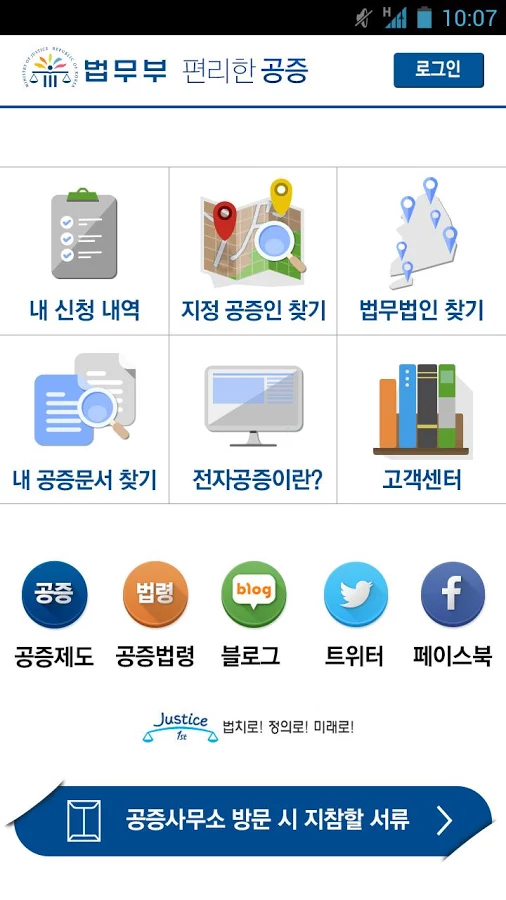
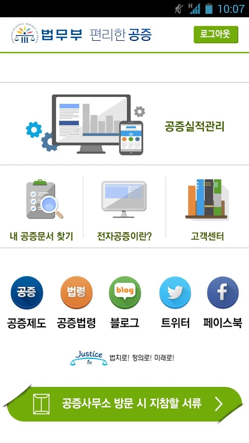
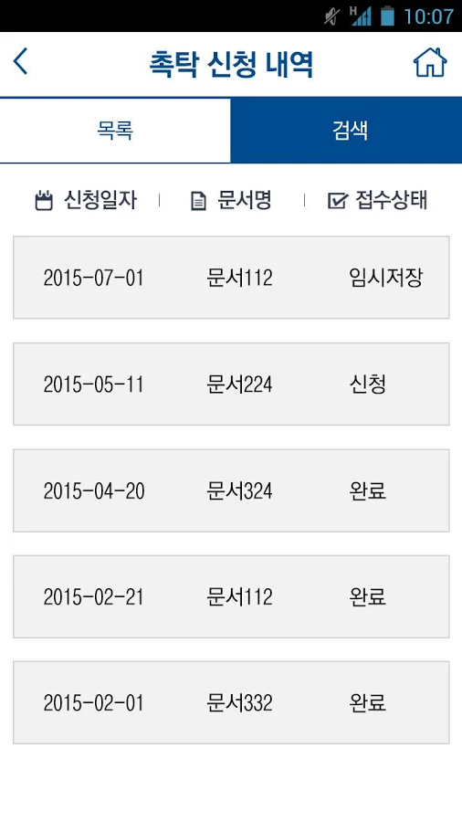
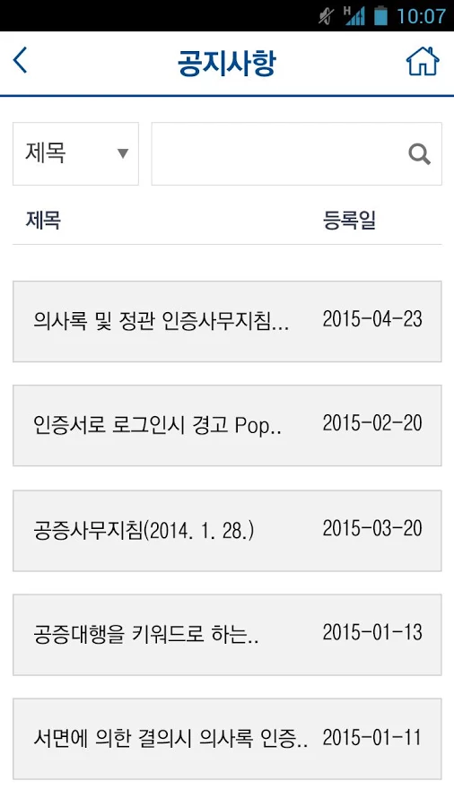
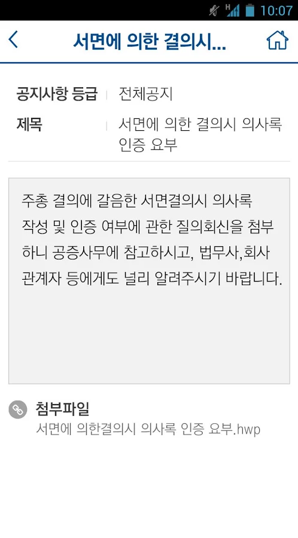

###4. 마이크임팩트 tv 앱 개발
강연회사인 마이크임팩트 회사의 Android 앱 개발
- 기간 : 2016.01 ~ 2016.04
- 역할 : UI 및 서버 통신 부분 개발, 동영상 플레이어(ExoPlayer) 라이브러리 활용 개발
- 사용기술 : Android, Java
- [PlayStore 링크](https://play.google.com/store/apps/details?id=ch.app.micimpact)

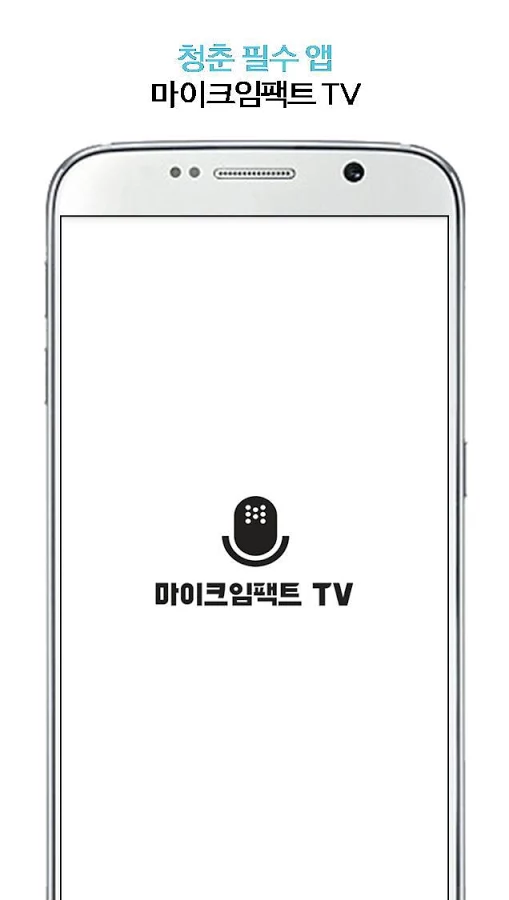
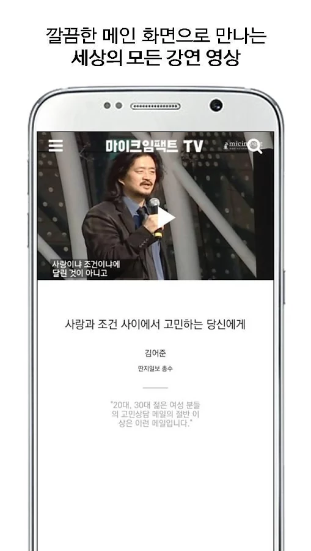
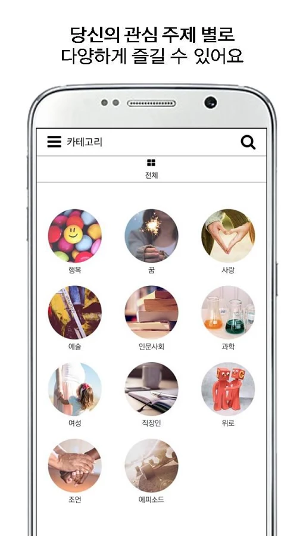
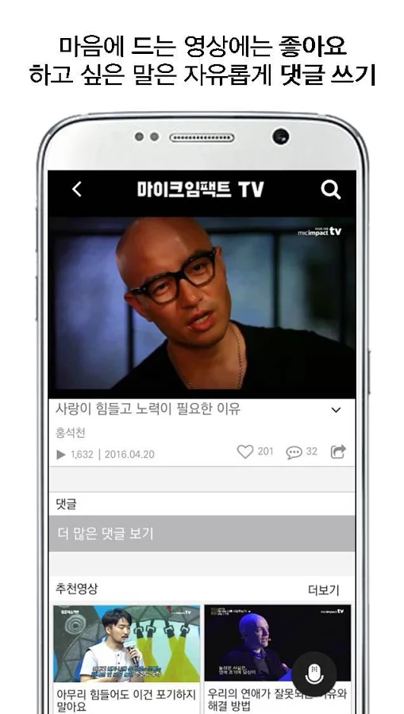
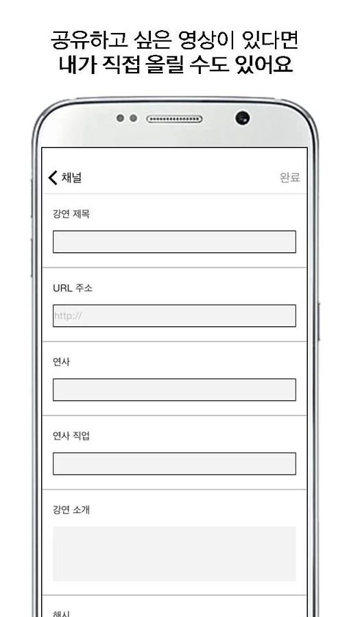
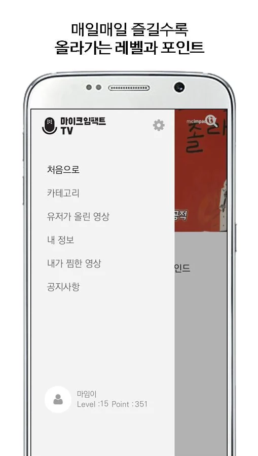

###5. Azit Study 앱 개발
청소년 학습분석 및 도움용 Android 앱 개발
- 기간 : 2015.11 ~ 2016.02
- 역할 : UI 개발 및 서버 연동 부분 개발
- 사용기술 : Android, Java
- [PlayStore 링크](https://play.google.com/store/apps/details?id=com.azitcompany.azitstudy)

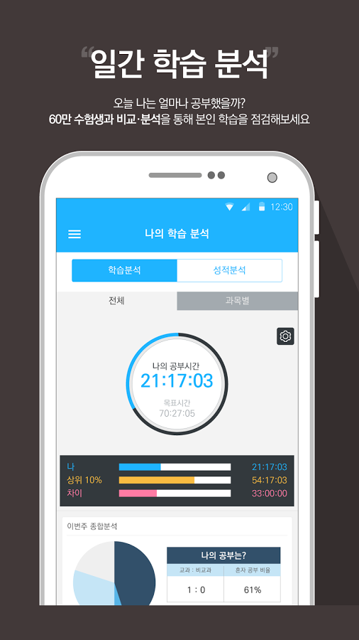
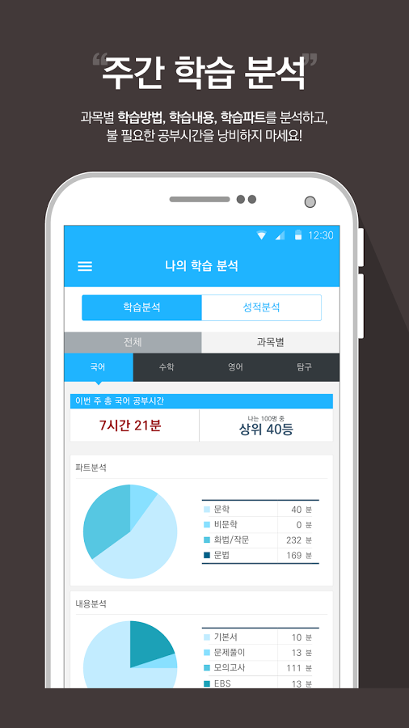
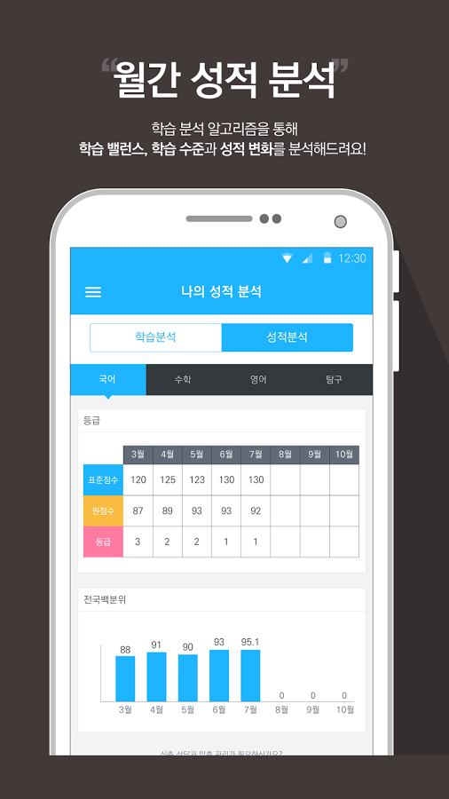
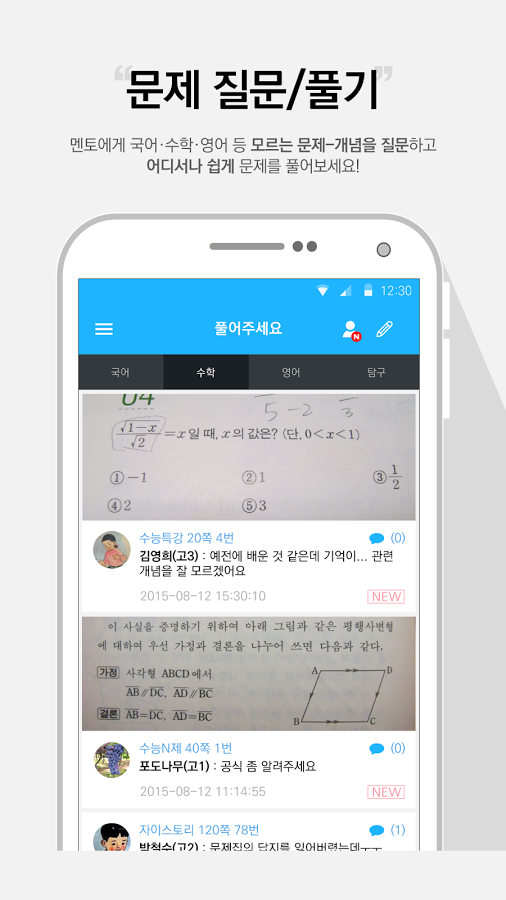

###6. BlindRing 앱 개발
통화 화면을 마음대로 커스터마이징 할 수 있도록하는 앱
- 기간 : 2016.02 ~ 2016.05
- 역할 : Android 앱 모든 개발부분 총괄(통화 감지 및 Custom UI 설정기능)
- 사용기술 : Android, Java
- 출시 준비중

###7. SigBang 앱 개발
가게(식당 등) 매물중개 서비스 앱
- 기간 : 2016.05 ~ 2016.09
- 역할 : Android 앱 모든 개발부분 총괄(매물 업로드 , 도로명주소 연동, Daum Map Api 연동, 모든 UI 및 기능 개발)
- 사용기술 : Android, Java
- [홈페이지 링크](http://www.sigbang.com/)
- 출시 준비중

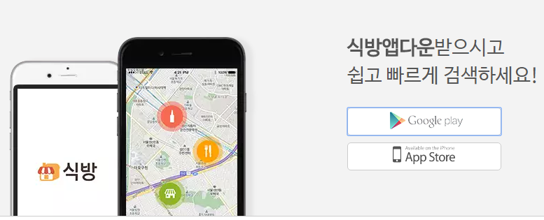

___

### 페이스북은 수시로 확인합니다.
### 연락은 아래로 주시기 바랍니다.
## facebook https://www.facebook.com/dakso053
## email jjgod0124@gmail.com
