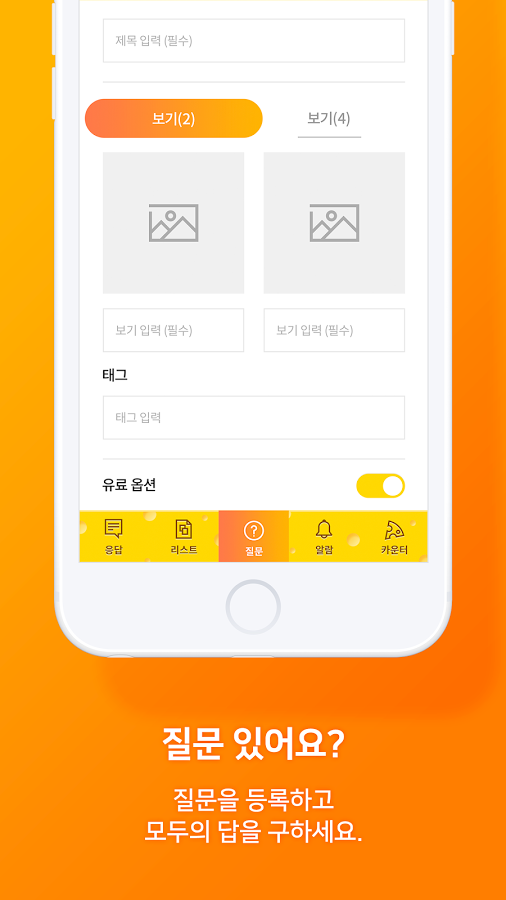
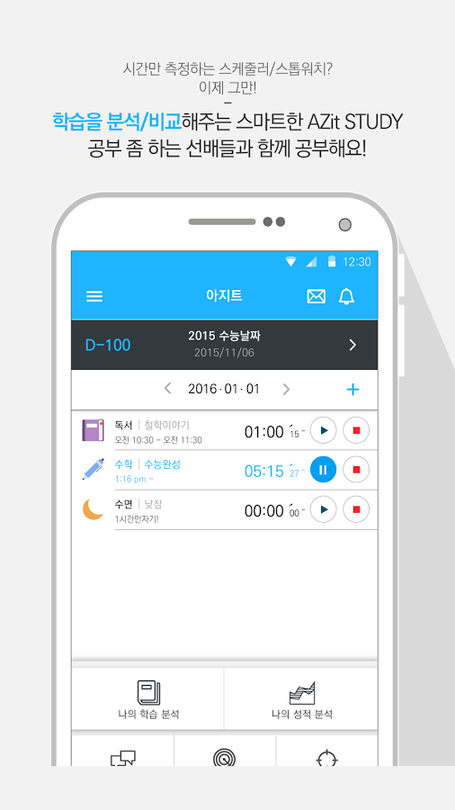

## 자기 소개
#### 안녕하세요. 최봉재입니다.
#### 제 소개 및 이력을 기재한 페이지입니다.

- 안드로이드 경력 6년차 개발자
- 새로운것을 배우는걸 좋아합니다.
- Github Action 으로 CI/CD 환경을 구축하여 테스터에게 배포한 경험이 있습니다.
- 앱을 개발하여 퍼블리싱까지 해본경험이 있습니다. / PlayStore - 담고풀고(서비스종료)
- 현재 초기 개발부터 완료하여 운영 해본 앱이 있습니다 / PlayStore - 치즈카운터(서비스종료)
- 상용 서비스를 운영하는 스타트업에서 앱 운영 및 리뉴얼 작업에 참여하였습니다. / PlayStore - 헤이딜러, 헤이딜러 딜러용
- 커머스 앱을 개발, 유지보수 한 경험이 있습니다. / PlayStore - 쇼아, 셀룩(쇼아 리뉴얼)
- 프로젝트에 적합한 패턴, 기술을 적용해보려 Medium, JetBrains 블로그 등을 구독하고 관심을 가지려 노력합니다.
- 프로젝트에서 팀플을 매우 중요시 생각합니다. 디자이너, 기획자분들과 협업경험이 다 수 있습니다.
- 저의 의견이 항상 틀릴 수 도 있다고 생각하고 열린자세로 커뮤니케이션에 임합니다.
- 무조건 안된다는 말보다는 차근차근 설명하려 합니다.
- 능동적인 자세로 개발관련 제안이나 기술을 먼저 제안하려 노력합니다. 
- 사내에서 스터디를 주도하여 운영한 경험이 있습니다.
- 제플린, 피그마, 지라 와 같은 협업툴을 사용해 본적이 있고 기획자, 디자이너와도 대화를 많이 하려 노력합니다.
- 소스코드 버전 관리를 매우 중요시 여깁니다. - git Repository 를 만드는일이 프로젝트 시작시 가장처음하는 일입니다.
- Git Flow 로 협업해본 경험 있습니다.
- Commit 메세지를 중요시 여깁니다. 기능 단위로 커밋하여 명시적으로 버전을 관리합니다.
- Glide, Retrofit2, Koin등 유명 라이브러리를 실무 수준으로 적용해보았습니다.
- Kotlin을 메인 언어로 사용합니다.
- RxJava를 실무 수준으로 사용해 보았으며 Stream 개념에 대해 이해 하고 있습니다.
- MVVM 패턴, Clean Architecture 을 기반으로 앱을 리뉴얼 해본적이 있으며 Databinding을 실무 수준으로 사용하며 data 처리와 view간의 결합도를 낮추려 노력합니다.
- Util 함수와 같이 반복적인 테스트를 요하는 기능은 UnitTest 코드를 작성 하여 검증합니다.
- 자료 참고시 공식문서와 공식 예제를 최우선시 합니다.
- 하이브리드 앱을 위한 FrondEnd Web 개발 경험이 있어 FrontEnd Web 개발자와 소통이 보다 용이합니다.
___

## 경력
[루나소프트](https://lunasoft.co.kr/home/main/page/main/index)
- 2021.05 ~ 2022.12(현재)

[피알앤디 컴퍼니](https://www.prnd.co.kr/)
- 2018.10 ~ 2020.12

[스펙업애드 타임스프레드 팀](https://www.timespread.co.kr/)
- 2018.03 ~ 2018.07

[씨이랩](http://www.xiilab.co.kr/)
- 2017.02 ~ 2018.03

[트램스](http://www.trams.co.kr/)
- 2015.07.22 ~ 2016.07.30

[애니웨어](http://u-anyware.com/)
- 2014.03.04 ~ 2014.07.14

___

## 개인 프로젝트

### 담고풀고

서운한 감정을 텍스트로 풀어 내보는 앱
- 기간 : 2016.08 ~ 2016.12
- 역할 : Android 앱 모든 개발부분 총괄
- 사용 기술 : Facebook API, Android
- [PlayStore 링크](https://play.google.com/store/apps/details?id=com.nexters.naemambo.naemambo) (서비스 종료)

 

___

## 참여 프로젝트

### [쇼아 - 쇼핑몰 상품 모음 - 앱 유지보수 및 추가기능 개발](https://www.showa.kr/)
https://play.google.com/store/apps/details?id=kr.co.lunasoft.showa&hl=ko

### [셀룩 - 쇼아 리뉴얼 쇼핑몰 모음 하이브리드 앱 및 FrontEnd 개발 참여](https://intro.cellook.kr/)
https://play.google.com/store/apps/details?id=kr.co.greenandgrey.cellook&hl=ko

### 1. 중고차 플랫폼 앱 - 헤이딜러, 헤이딜러 딜러용 앱 개발 (상용 서비스)
https://play.google.com/store/apps/details?id=kr.perfectree.heydealer&hl=ko&gl=US
https://play.google.com/store/apps/details?id=kr.perfectree.heydealerfordealer&hl=ko&gl=US

https://play.google.com/store/apps/details?id=com.timespread.Timetable2&hl=ko
### 2. 리워드 기반 돈주는 시간표 앱 타임스프레드 개발
리워드 기반 질응답 서비스 (REST API를 이용한 데이터 통신, 사진 크롭 업로드, 소셜 로그인 및 다수의 이미지 컨트롤)
- 기간 : 2018.03 ~
- 역할 : 공지사항 , CS툴 도입, 로그인 및 회원가입 기능 개발, 앱 권한 기능 개발, Rxjava2 도입
- 사용기술 : Android, Java, Kotlin, Rxjava2, RxKotlin2
- [PlayStore 링크](https://play.google.com/store/apps/details?id=com.timespread.Timetable2&hl=ko)

 

### 3. 설문 기반 리워드 서비스 앱 치즈카운터 개발
리워드 기반 질응답 서비스 (REST API를 이용한 데이터 통신, 사진 크롭 업로드, 소셜 로그인 및 다수의 이미지 컨트롤)
- 기간 : 2017.03 ~ 개발완료(운영종료)
- 역할 : 카메라 , 이미지, 네트워크 데이터 통신 처리, 및 개발 모든 부분 총괄
- 사용기술 : Android, Java, Kotlin, Fresco, Android Data Binding,  Android Architecture Component(부분 적용)
- [PlayStore 링크](https://play.google.com/store/apps/details?id=com.xiilab.servicedev.cheesecounter)

 

### 4. SK T아카데미 IoT M2M 교재 개발
소켓통신을 활용한 원격카메라 제어, 원격 어플리케이션 실행 기능 개발
- 기간 : 2013.12 ~ 2014.02
- 역할 : 카메라 원격제어 기능 개발, 소켓통신 모듈 개발
- 사용기술 : Android, Java
- [홈페이지 링크](https://tacademy.sktechx.com/frontMain.action) (내부 프로젝트)

### 5. EMSONEPACK 물류센터 PDA 앱
한국우편사업진흥원 EMSONEPACK(역직구 - 국내에서 해외로 합포장 서비스) 물류센터 직원용 PDA 앱
- 기간 : 2015.09 ~ 2016.02
- 역할 : UI 및 서버 통신 부분 개발
- 사용기술 : Android, Java
- [홈페이지 링크](https://www.emsonepack.com/) (내부 프로젝트)

### 6. 법무부 편리한 공증제도 앱 개발
사용자 분류(공증인)에 따라 다른 화면을 보여주는 Custom UI 가 적용된 공증제도 홍보용 앱
- 기간 : 2015.08 ~ 2015.11
- 역할 : UI 및 서버 통신 부분 개발, REST API 개발
- 사용기술 : Android, Java
- [PlayStore 링크](https://play.google.com/store/apps/details?id=com.trams.moj)

 

### 7. 마이크임팩트 tv 앱 개발
강연회사인 마이크임팩트 회사의 Android 앱 개발
- 기간 : 2016.01 ~ 2016.04
- 역할 : UI 및 서버 통신 부분 개발, 동영상 플레이어(ExoPlayer) 라이브러리 활용 개발
- 사용기술 : Android, Java
- [PlayStore 링크](https://play.google.com/store/apps/details?id=ch.app.micimpact) (앱 내림)

 

### 8. Azit Study 앱 개발
청소년 학습분석 및 도움용 Android 앱 개발
- 기간 : 2015.11 ~ 2016.02
- 역할 : UI 개발 및 서버 연동 부분 개발
- 사용기술 : Android, Java
- [PlayStore 링크](https://play.google.com/store/apps/details?id=com.azitcompany.azitstudy) (서비스 종료)

 

### 9. BlindRing 앱 개발
통화 화면을 마음대로 커스터마이징 할 수 있도록하는 앱
- 기간 : 2016.02 ~ 2016.05
- 역할 : Android 앱 모든 개발부분 총괄(통화 감지 및 Custom UI 설정기능)
- 사용기술 : Android, Java

### 10. SigBang 앱 개발
가게(식당 등) 매물중개 서비스 앱
- 기간 : 2016.05 ~ 2016.09
- 역할 : Android 앱 모든 개발부분 총괄(매물 업로드 , 도로명주소 연동, Daum Map Api 연동, 모든 UI 및 기능 개발)
- 사용기술 : Android, Java

___

### 연락은 아래로 주시기 바랍니다.
## facebook https://www.facebook.com/dakso053
## email jjgod0124@gmail.com
